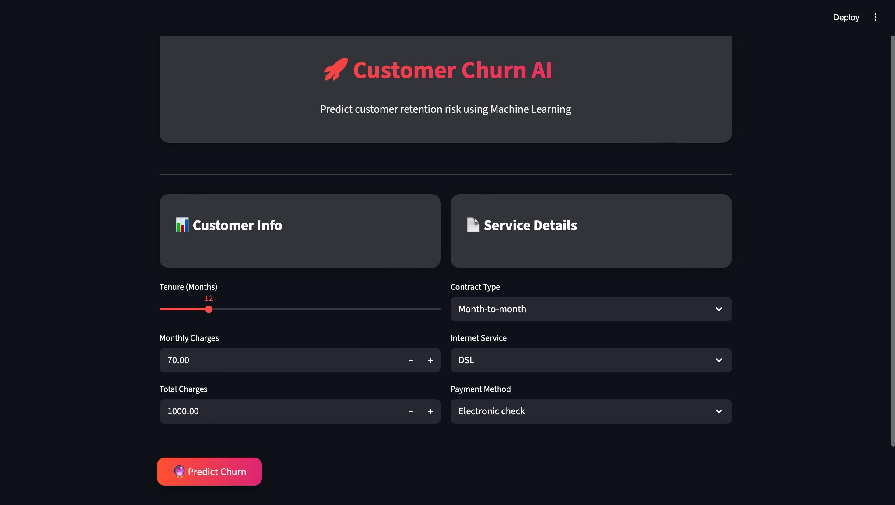
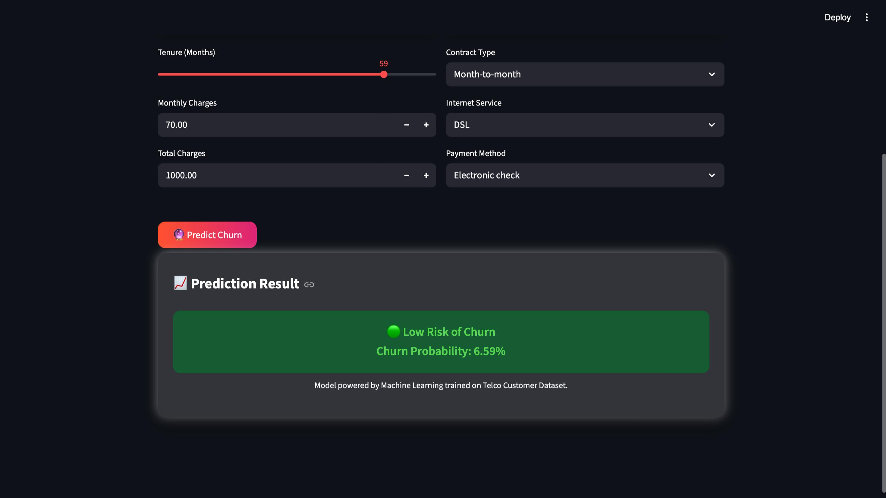

<h1 align="center">🚀 Customer Churn AI</h1>

<p align="center">
An AI-powered platform that predicts customer churn risk.  
This is the <b>beginning of a larger vision</b>: a comprehensive customer retention system with dashboards, personalized suggestions, and enhanced predictive models across multiple industries.
<br><br>
Built with <b>Python</b> and <b>Streamlit</b>, featuring an elegant glassmorphism UI and interactive prediction cards.
</p>

<p align="center">
  
  
  
  
  
  
  
</p>
---

## 🚀 Project Overview

**Customer Churn AI** currently allows users to:

- Input basic customer information (tenure, charges, contract type, internet service, payment method)  
- Predict the risk of churn (Low, Medium, High)  
- Visualize churn probability with a progress bar  

This is **just the beginning**. The platform will evolve into a **full-fledged dashboard** for businesses with:

- Multi-domain support (telecom, food delivery, membership services, retail buyers, etc.)  
- Personalized suggestions for retaining each customer  
- Advanced ML models trained on additional features (e.g., age, gender, purchase history)  
- Enhanced analytics and visualization tools  

---

## 🎯 Current Features

### 📊 Basic Churn Prediction
- Input fields for customer details  
- Predict churn risk:  
  - 🟢 Low Risk  
  - 🟡 Medium Risk  
  - 🔴 High Risk  
- Probability percentage displayed dynamically    

---

## 🔮 Future Roadmap

The project will evolve to include:

### 1️⃣ Multi-Domain Dashboard
- Food services, membership programs, retail buyers, telecom, etc.  
- Visual insights into customer behavior trends  

### 2️⃣ Personalized Retention Suggestions
- AI-driven advice for retaining each customer  
- Recommendations based on churn probability and customer profile  

### 3️⃣ Enhanced ML Models
- Incorporating more features: age, gender, location, purchase history, engagement  
- Multiple models trained for best prediction accuracy  
- AI models continuously improved using new datasets  

### 4️⃣ Advanced Analytics
- Customer segmentation dashboards  
- Predictive trends over time  
- Heatmaps, bar charts, and KPI indicators  
- Integration with CRM systems  

### 5️⃣ Future Enhancements
- Real-time alerts for high-risk customers  
- Automated notifications for retention strategies  
- Adaptive models for different industries and business sizes  

---

## 📸 Demo Screenshots (Current Version)

### 🏁 Customer Input
<p align="center">
  
</p>

### 🔮 Prediction Result
<p align="center">
  
</p>

> ⚠️ Note: This is the **initial version**—focused on basic churn identification. The dashboard and advanced features will be added in future updates.

---

## 🏗️ Project Structure

```bash
Customer_Churn_AI/
│
├── app.py                     
├── predict.py                 
├── requirements.txt           
├── README.md                  
│
├── assets/                    
│   ├── input_card.png
│   └── prediction_result.png
│
├── model/                    
│   └── train.py
│
├── data/                    
│   ├── telco_churn_clean.csv
│   └── predictions.csv   
│
├── models/                    
│   ├── best_model.pkl
│   ├── feature_columns.pkl   
│   └── xgboost_model.pkl
│
├── notebooks/                
│   └── eda.ipynb
```
## 🛠️ Tech Stack

**Language:** Python  
**Framework:** Streamlit  
**Data Handling:** Pandas, NumPy  
**Machine Learning:** scikit-learn  
**Styling:** Custom CSS (Glassmorphism)  

## ⚠️ Disclaimer

This platform is currently in its **early version**:

- It identifies basic churn risk only  
- Not all features are implemented yet  
- It is meant for educational purposes and business insights support  

Future updates will make it a **comprehensive predictive and recommendation system**.

---

## 📄 License

MIT License – free to **use, modify, distribute**, with proper attribution.

---

## 👨‍💻 Author

Developed by **Raj Darlami**  

If you like this project, consider giving it a ⭐ on GitHub.

